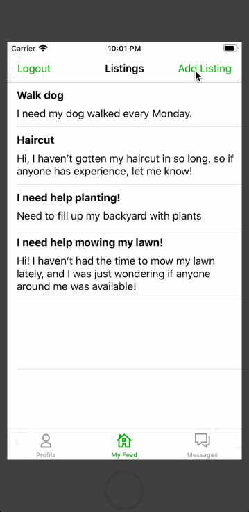

# QuickWork

## Table of Contents
1. [Overview](#Overview)
1. [Product Spec](#Product-Spec)
1. [Wireframes](#Wireframes)
2. [Schema](#Schema)

## Overview
### Description
QuickWork is a quick and efficient freelancing app that supports messaging.

### App Evaluation
- **Category:** Business
- **Mobile:** This app is optimized for iOS (mobile) because of its native features. This app also relies on MessageKit, which provides elegant messages.
- **Story:** We want to develop a quick and efficient freelancing app that enables users to post and search tasks, communicate easily, and perform transactions all in one app.
- **Market:** People in densely populated communities looking to effectively get a task done. Freelancers looking to complete tasks.
- **Habit:** People looking to post jobs will probably use this app once every week to month. People looking to complete jobs will probably use this app more frequently.
- **Scope:** We will first release the app once basic features and messaging feature is implemented. Then we will add additional functionality like search, in-app payments, etc....

## Product Spec

### 1. User Stories (Required and Optional)

**Required Must-have Stories**

* User can create an account and add basic personal info.
* User can login to a feed of tasks.
* User can add a new task.
* User can view the tasks they posted in profile tab
* User can tap on a task to view additional details
* User can message another user about a task

**Optional Nice-to-have Stories**

* User can search for a task
* User can pay on the app
* User can mark when a task is finished/ delete a task
* User can update their profile

### 2. Screen Archetypes

* Login screen
   * Upon opening the app, the user has the option to log in with an existing account or sign up.
* Signup/basic information screen
   * Upon clicking the signup button, the user will into a username and password and entering it will direct them to another screen where they input their profile information (name, email, phone, optional profile picture).
* Main feed screen
   * Displays a table view of all the tasks the users post.
* Details screen
   * Displays additional information (description, location, ...) for one particular task. 
* Add listing screen
   * User can add information about a new task they're going to post.
* Profile screen
   * Displays user's basic information and a table view containing only the user's posts. 
* Edit info screen
   * User can edit their name/email/phone number/profile picture.
* Messages screen
   * A table view of the current user's conversations with different users.
* Chat screen
   * User can message another user.
 

### 3. Navigation

**Tab Navigation** (Tab to Screen)

* Profile screen
* Feed screen
* Messages screen

**Flow Navigation** (Screen to Screen)

* Login screen
   * Sign in screen
   * Main feed screen
* Sign in screen -> input basic info screen -> main feed screen
* Main feed screen
   * Add listing screen
   * Details screen
* Profile screen
   * Edit profile screen
   * Details screen
* Details screen -> chat screen
* Messages screen -> chat screen

## Wireframes

## Schema 
### Models
#### User

   | Property      | Type     | Description |
   | ------------- | -------- | ------------|
   | objectId      | String   | unique id for the user (default field) |
   | number        | String   | user's phone number |
   | username      | String   | user's username |
   | password      | String   | (hidden) |
   | email         | Number   | user's email address |
   | picture       | File?    | user can upload an optional photo |
   | createdAt     | DateTime | date when post is created (default field) |
#### Message

   | Property      | Type     | Description |
   | ------------- | -------- | ------------|
   | objectId      | String   | unique id for the message (default field) |
   | message        | String   | message sent by user |
   | recipient      | String   | foreign key from User's objectId |
   | sender      | String   | foreign key from User's objectId |
   | name         | Number   | name of the user that sent the message |
   | createdAt     | DateTime | date when message is created (default field) |
#### Tasks

   | Property      | Type     | Description |
   | ------------- | -------- | ------------|
   | objectId      | String   | unique id for the task (default field) |
   | city          | String   | city in which task takes place |
   | name          | String   | name of the task |
   | user          | String   | foreign key from User's objectId of the user that posted the task |
   | image         | File?   | optional image for task |
   | description   | String   | description for the task |
   | createdAt     | DateTime | date when post is created (default field) |

### Networking
- [Add list of network requests by screen ]
- [Create basic snippets for each Parse network request]
- [OPTIONAL: List endpoints if using existing API such as Yelp]

## Presentation

Here's our group's [presentation](https://docs.google.com/presentation/d/1zp3fNso_jEsT2tvyq15--9_hW8GmKbTj_cH_Jw0Xatw/edit?usp=sharing) for CodePath at UCI's Demo Day 6/6/2020.
